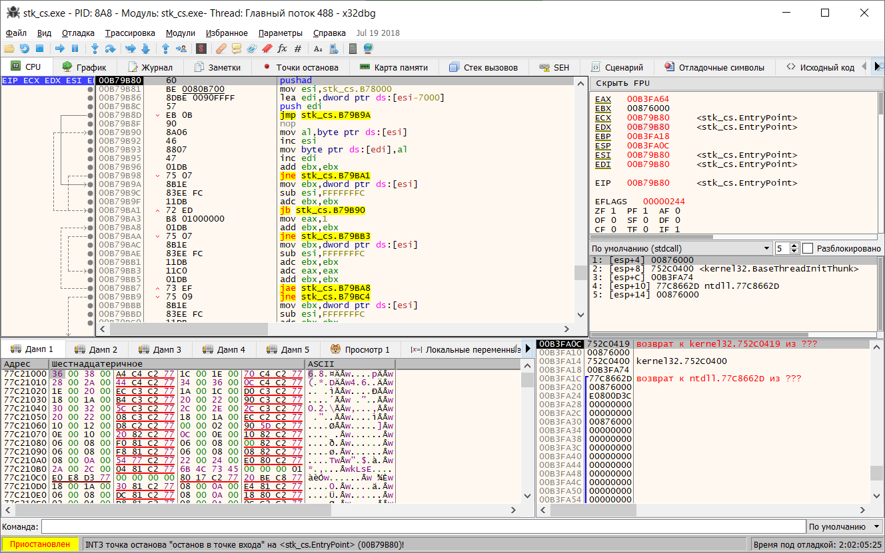
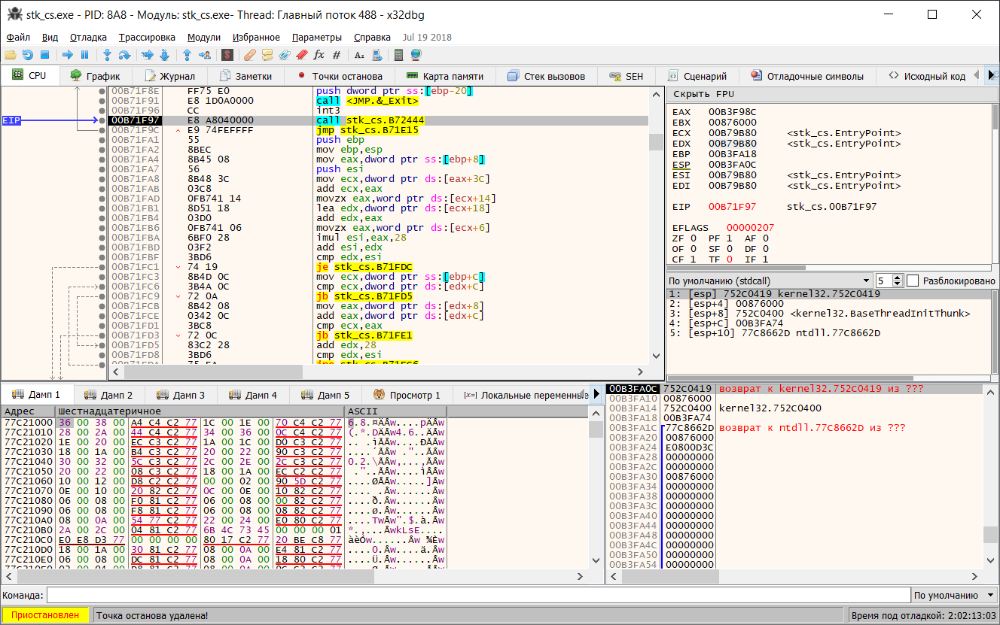
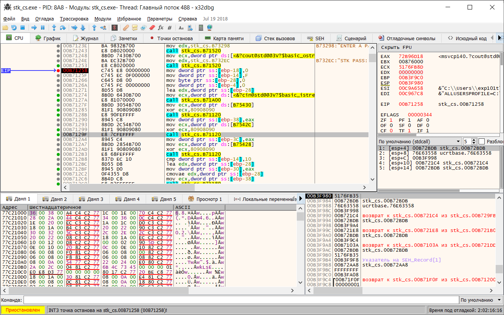
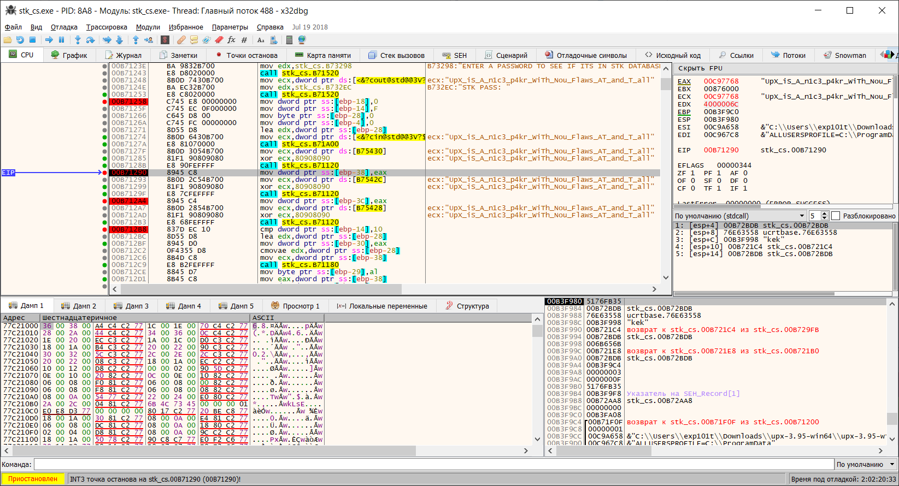
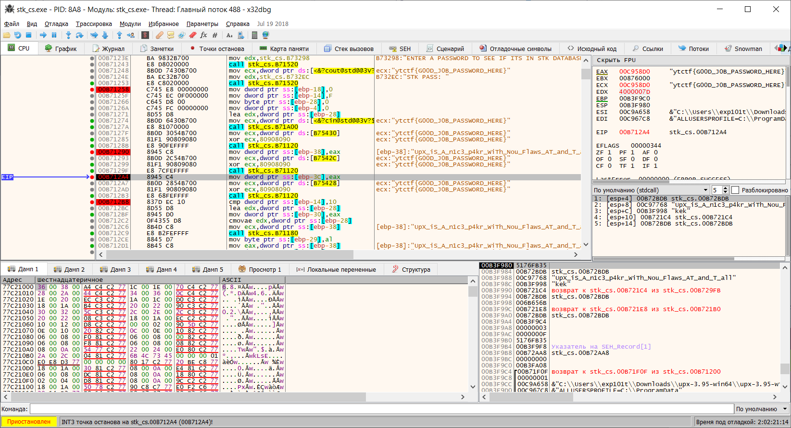
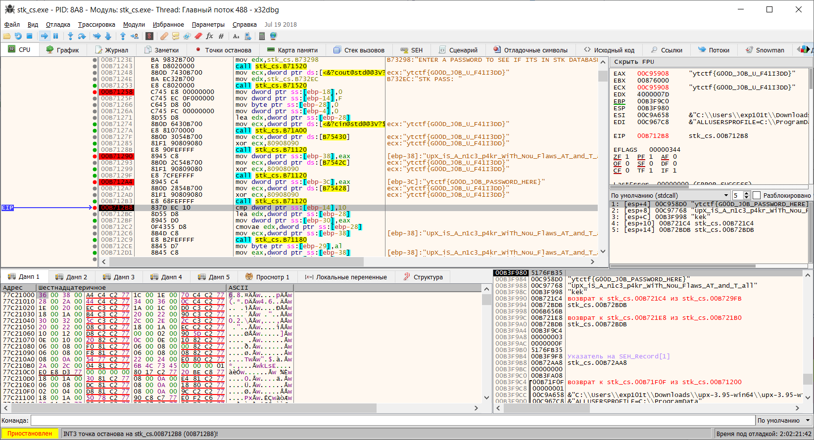
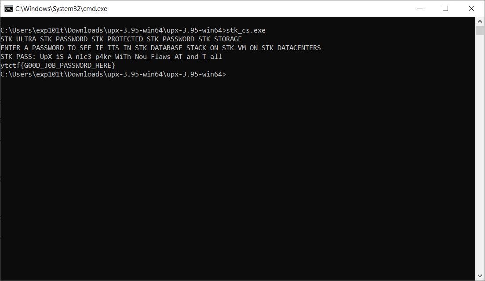

# STK Crypto Storage by MrSteyk - Reverse, 200 баллов [Дорешивание]
Если скормить бинарь из таска DiE, узнаем, что он упакован UPX. Попробуем распаковать этот самый UPX автоматической тулзой.

UPX'у это не особо понравится, и он скажет, что бинарь модифицирован. 

Что ж, придется распаковывать вручную. Загрузим `stk_cs.exe` в `x32dbg`.

EntryPoint файла расположен на инструкции `pushad`, которая кладет значения всех регистров на стек. Логично предположить, что распаковка закончится на инструкции `popad`.

Найдем такую в бинаре и поставим на неё бряку. 

Дойдем до адреса `B79D34h`, сделаем прыжок и выйдем на оригинальную точку входа. 

Найдем xref на строку "STK PASS:" и выйдем на `main`. 

Видим в ближайших инструкциях вызовы одной и той же функции. Посмотрим, что каждый из этих вызовов возвращает. 

Видно, что через регистр `ecx` функция `stk_cs.B71120` принимает указатель на строку и расшифровывает её (если её отреверсить, то станет понятно, что она `xor`-ит байты переданного буфера с `80h`).

Несложно догадаться, что `UpX_iS_A_n1c3_p4kr_WiTh_Nou_Flaws_AT_and_T_all` - это и есть пароль. Пробуем его ввести, и программа его принимает. 

Оборачиваем эту строку в `ytctf` и сдаем как флаг. 

**Флаг:** `ytctf{UpX_iS_A_n1c3_p4kr_WiTh_Nou_Flaws_AT_and_T_all}`
